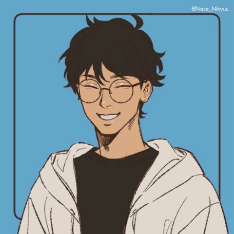

# *Welcome!! I am Enzo Daniel Marinho 👋*

- 🐧 I'm Linux Enthusiast who likes to play around with Computers and some others stuffs.
- 🔭 I'm currently studying Computer Engineering while I try to learn how to get out of Vim 
- 🌱 I like studying Linux, Bash, Rice, Networks, DevOps and Cybersecurity 
- 😄 Pronouns and Country: He/Him (Brazil)

 
  
### _My contacts ☎️_
---

### *Statistics 📈*
---
  

### *Skills 🔥:*
---

